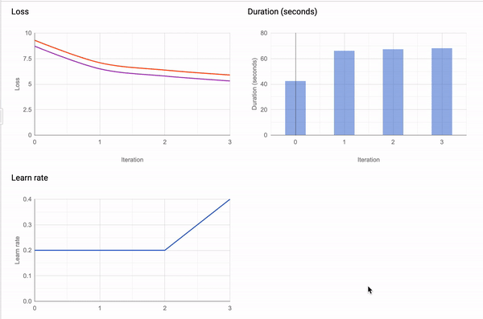
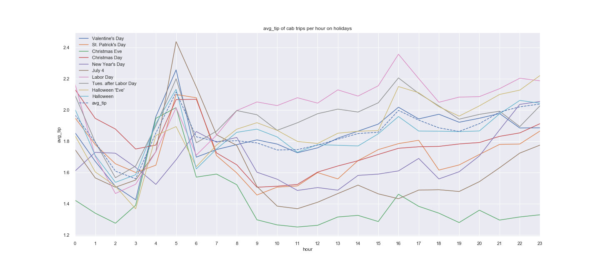

<h1 align="center">Welcome to Hot Tips for Cabbies: Using Big Data to Optimize NYC Taxi Gratuities  👋</h1>
<p>
  <a href="#" target="_blank">
    
  </a>
  <a href="https://twitter.com/lorarjohns" target="_blank">
    
  </a>
</p>

> Using BigQuery's native Machine Learning tools and cloud database, can we discover the latent factors that lead to the greatest tips for working cab drivers in NYC?

## The Goal: Fit a model to predict the gratuities on a fare

Ride-sharing is taking over the country, and public transportation is declining. 
 
 The burden on the roads puts strain on city infrastructure, causes traffic problems for individual drivers, and widens the access gap for people in areas with poor public transportation.
 
What are the most valuable taxi rides? Where do they originate from? When do they occur? The answer to these questions could help us identify areas where public service can be improved.

## The Data: New York City Yellow Taxi Rides in 2018

```sql

```
We use the [Taxi and Limousine Commission Yellow Cab (TLC)](http://www.nyc.gov/html/tlc/html/about/trip_record_data.shtml) trip data from 2018. The TLC has released public taxi data from 2009 to present, available free to access on [Google BigQuery](https://console.cloud.google.com/marketplace/details/city-of-new-york/nyc-tlc-trips).

For 2018, the database contains 112,234,626 records of Yellow Cab rides. Records include pick-up and drop-off dates/times, locations, trip distances, itemized fares, rate types, payment types, and driver-reported passenger counts.

## The Model: Machine Learning in BigQuery

- Data analysis and visualization with BigQuery's analytic tools, pandas, and ggplot in R
- BigQuery's native machine learning tools to model tip volume and engineer features



## Some findings

- Thursday had the highest correlation with tips. Saturday had the lowest.
- The feature most strongly correlated with tips was the engineered airport variable.
- Queens tips the best. Staten Island tips the worst.



## Author

👤 **Lora Johns**

* Twitter: [@lorarjohns](https://twitter.com/lorarjohns)
* Github: [@lorarjohns](https://github.com/lorarjohns)

## Show your support

Give a ⭐️ if this project helped you!

<a href="https://www.patreon.com/lorarjohns">
  
</a>

***
_This README was generated with ❤️ by [readme-md-generator](https://github.com/kefranabg/readme-md-generator)_